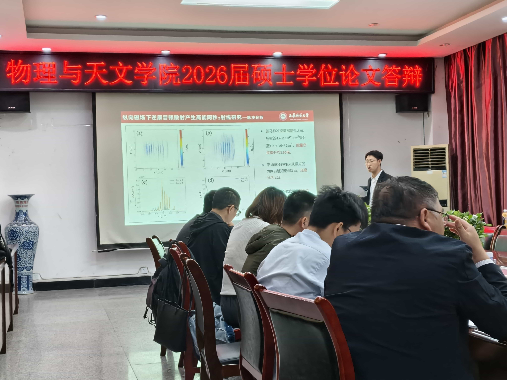

## 陈鹏帆通过硕士学位论文答辩

> 2026年05月15日

2026年05月15日下午3点，本课题组的硕士学位论文答辩顺利召开，本组的3位物理学研究生身着正装，依次上台对自己的学位论文、研究工作、学术成果等展开介绍，并对评委专家的提问进行回答。 
 
 
> 正在介绍研究的陈鹏帆同学。
经过紧张、激烈地讨论后，决定通过陈鹏帆的答辩，并将其论文推荐为优秀硕士学位论文。 
 
> 答辩后的捧着鲜花的陈鹏帆同学。
